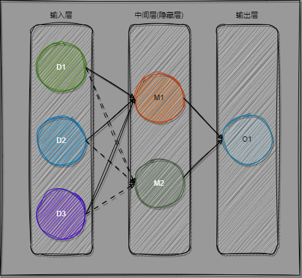

### 全连接层的基本结构
+ example 1, 最简单的例子  

1. 输入层: 就是你的数据, 比如 一组今天天气的数据 (湿度，温度，气压) 去预测明天 是否 下雨
2. 中间层(隐藏层). 形象的理解为 神经元的链接就好了 (本质上也是从这里出来的) @TODO, 神经网络的发展历史
3. 输出层预测结果。

+ Dx 与 Mx 的关系？
$$ M_1 = W_{11}*D_1 + W_{12}* D2 + W_{13}* D3 $$  
$$M_2 = W_{21}*D_1 + W_{22}* D2 + W_{23}* D3$$  

+ 显然是个矩阵运算, 将 W 和 D 用行列式表示:  
$$D=\begin{bmatrix}
D_1 & D_2 & D_3
\end{bmatrix} ,
W=\begin{bmatrix}
W_{11} & W_{21} \\
W_{12} & W_{22} \\
W_{13} & W_{23}
\end{bmatrix},
M=\begin{bmatrix}
 M_1 & M_2
\end{bmatrix}$$  

+ 思考为什么要不同的权重,相同权重不行吗？ 如何形象解释神经元(每个node)的作用？
