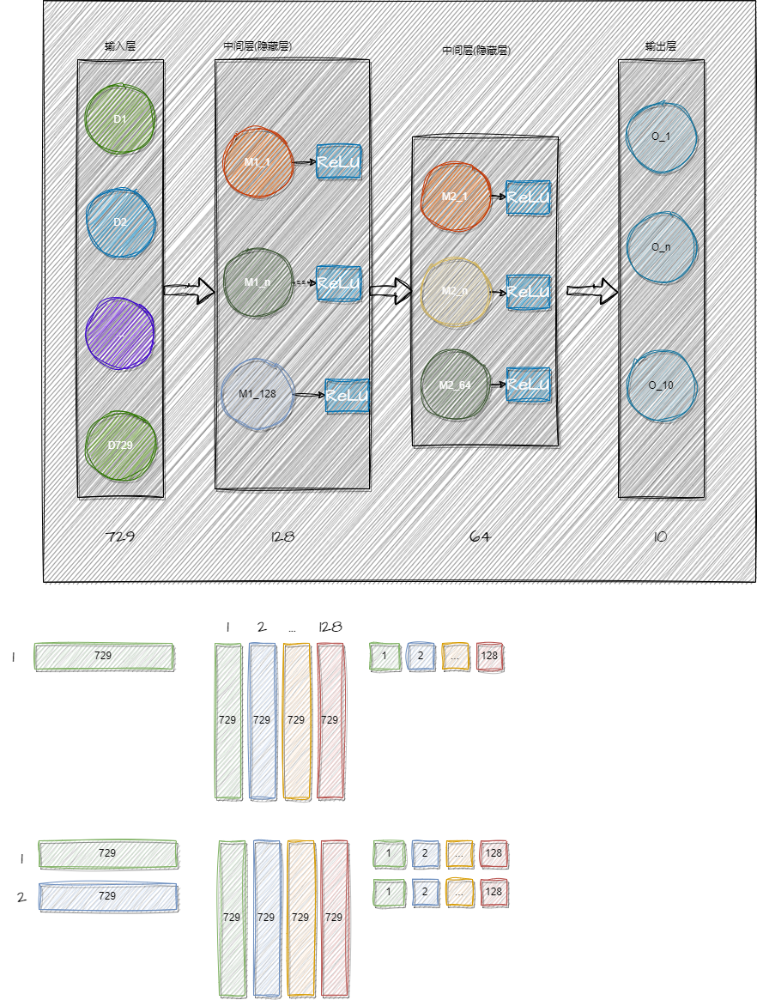

### 简单的全连接层网络
+ example 3：下面是一个简单的全连接层网络，用于 MNIST数据集


+ 由4层组成, 输入层， 中间层， 中间层， 输出层
+ 输入层是729(1张27*27像素展开后大小）， 中间层128：包含128个节点， 中间层64：包含64个节点，输出层10 包含10个节点(输出值0-9)

+ 当输入只有1张图片时(称为batch size == 1)，运算如中间图所示, 128个节点，每个节点都有729个参数，因为有729个输入连与它相连，那么共有 729*128个参数。
+ 当输入有2张图片时(成为batch size ==2)， 运算如最下图所示。batch size 并不会影响权重的个数

假设 batch size 为N， 则有
```math

(N,729) * (729,128) * (128,64) * (64*10) = (N*10)

```
所以最后 输出的时 N 个 1*10的向量。


#### 代码重新整理成

简单的向量运算: dot
+ vecotr_op.cpp/hpp
DL相关的函数: softmax, relu
+ deep_core.cpp/hpp
测试代码：
+ test_dot.cpp
+ test_activation.cpp


