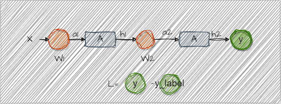

### Loss - 1

+ 什么是loss？
+ 用来干什么？
+ 为什么要有？
+ 有哪些？

https://zhuanlan.zhihu.com/p/261059231

+ 这里采用 MSE， Mean Squared Error
```math
L(Y|f(x)) = \frac{1}{n}\sum^N_{i=1}(Y_i=f(x_i))^2
```
表示 预测 与 实际结果 的平均距离


思考
+ loss 怎么传递的？为什么能让loss下降 ？


<!-- 
#### loss 反向传播最简单例子
https://zhuanlan.zhihu.com/p/115571464

假设现在有3层网络。每层只有1个节点


+ 本质上 可以先看成 函数运算
```math 
a1 = f(x) = x*W_1 \\
h1 = A(a1) \\
a2 = f(h1) = h1 * W_2 \\
h2 = A(a2) \\
y = h2 \\
```
>(对 f(x) 求 其导函数 大家都会的吧)（这里是山寨数学，看看笑一笑就好了, 正经人还是回去复习高数）
y=f(x)= ax+b 为例子， $\frac{dy}{dx} = f'(x) = a $
那么当 y = f(x,z) = ax+bz 时， $\frac{dy}{dx} = ?$
这里可以理解为 一个二位平面上的函数(比如海拔图啥的)，对x方向上求它的导函数(梯度函数(梯度是什么？就是海拔再移动单位距离里变化的大小)),就有了emm 偏微分。
那么这个玩意和y有没有关系呢？如果含x项带有y就有关系，没有就没有关系。（Todo 看看具体例子）
那么就有 $\frac{dy}{dx} = ax^{1-1=0} = a = \frac{\partial{y}}{\partial{x}}$

那么当 $L=\Delta{y}= y - y_{label}$ 时，要求$h2$ 对 $L$的影响, 则有下面:
```math 
\frac{\partial{L}}{\partial{h2}}
```
要求$a2$ 对 $L$的影响，则先求 $a2$ 对 $h2$的影响：
```math 
\frac{\partial{h2}}{\partial{a2}} = A'(a2) 
```
那么 $a2$ 对 $L$:
```math
\frac{\partial{L}}{\partial{a2}} = 
\frac{\partial{L}}{\partial{h2}} * \frac{\partial{h2}}{\partial{a2}} = \frac{\partial{L}}{\partial{h2}} * A'(a2)
```
同理求 $h1$ 对 $L$影响
```math
\frac{\partial{L}}{\partial{h1}} =\frac{\partial{L}}{\partial{a2}} * \frac{\partial{a2}}{\partial{h1}} = \frac{\partial{L}}{\partial{a2}} * W_2
```

得到了梯度之后呢？为什么减去梯度就能改变？
如 梯度表示变化方向和大小，如 2* w = 8 （w=4, yb=10） L=-2,  w对 L 的影响 = dL/dw = 2  -->
