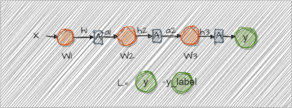

### Loss - 1

首先明确:
+ 训练的目的是找到一个最小的Loss
+ 那么 Loss 对 参数 w的梯度 可以说明 参数 w 对 Loss的影响情况
+ 如果 g 是正的  那么 新 W 应该朝着反向走 即 $w^* = w - g$
+ 如果 g 是负的，那么 新 W 也应该朝着反向向走， 即 $w^* = w - g$ (此处当成向量理解就能理解为为什么 都是 负 号了)


#### loss 反向传播最简单例子
https://zhuanlan.zhihu.com/p/115571464

假设现在有3层网络。每层只有1个节点  



+ 本质上 可以先看成 函数运算

>(对 f(x) 求 其导函数 大家都会的吧)（这里是山寨数学，看看笑一笑就好了, 正经人还是回去复习高数）
y=f(x)= ax+b 为例子， $\frac{dy}{dx} = f'(x) = a $
那么当 y = f(x,z) = ax+bz 时， $\frac{dy}{dx} = ?$
这里可以理解为 一个二位平面上的函数(比如海拔图啥的)，对x方向上求它的导函数(梯度函数(梯度是什么？就是海拔再移动单位距离里变化的大小)),就有了emm 偏微分。
那么这个玩意和y有没有关系呢？如果含x项带有y就有关系，没有就没有关系。（Todo 看看具体例子）
那么就有 $\frac{dy}{dx} = ax^{1-1=0} = a = \frac{\partial{y}}{\partial{x}}$


那么当 $L=MSE(y,y_{label}) = \frac{(y-y_{lable})^2}{n}$ 时，要求 $y$ 对 $L$ 的影响 (输出层的梯度(偏微分)), 则有下面:
```math
\frac{\partial{L}}{\partial{y}} = \frac{2*(y-y_{label})}{n}
```

那么 $w_3$ 对 L 的影响
```math
\frac{\partial{L}}{\partial{w_3}} = \frac{\partial{L}}{\partial{w_3}} * \frac{\partial{y}}{\partial{h_3}} * \frac{\partial{L}}{\partial{y}} = a_2 *  [\frac{\partial{y}}{\partial{h_3}}] * \Delta{y}
```
+ 思考 1. 能否直接跳过softmax 求导这一步


那么 $w_2$ 对 L 的影响:
```math
\frac{\partial{L}}{\partial{w_2}} = \frac{\partial{h_2}}{\partial{w_2}} * \frac{\partial{a_2}}{\partial{h_2}} * \frac{\partial{h_3}}{\partial{a_2}} * [\frac{\partial{y}}{\partial{h_3}}] * \frac{\partial{L}}{\partial{y}} = a_1 *  A'(h_2) * w_3 * [\frac{\partial{y}}{\partial{h_3}}] * \Delta{y}
```
+ 思考 2.  对于 Relu 激活函数，反向传播时， 输入是什么？ 为什么可以是 正向的输出？


### 当变成多个节点的时候:


这里的网络运算可表达为:
```math
\begin{align}
  \begin{pmatrix}
  x1 & x2 \\
  \end{pmatrix}  
  *
  \begin{pmatrix}
  w_{11} & w_{21} \\
  w_{12} & w_{22} \\
  \end{pmatrix}
  =
  \begin{pmatrix}
  x_1*w_{11}+ x_2*w_{12} &  x_1*w_{21}+x_2*w_{12} \\
  \end{pmatrix} 
  =
  \begin{pmatrix}
  h_{11} &  h_{12} \\
  \end{pmatrix}
\end{align}
```
同理 完整过程
``` math
\begin{align}
  \begin{pmatrix}
  x1 & x2 \\
  \end{pmatrix}  
  \begin{pmatrix}
  w_{11} & w_{21} \\
  w_{12} & w_{22} \\
  \end{pmatrix}
  &->
  \begin{pmatrix}
  h_{11} &  h_{12} \\
  \end{pmatrix}
  -> \\  
  \begin{pmatrix}
  a_{11} &  a_{12} \\
  \end{pmatrix}

  \begin{pmatrix}
  w_{211} & w_{221} \\
  w_{212} & w_{222} \\
  \end{pmatrix}
  &->
  \begin{pmatrix}
  h_{21} &  h_{22} \\
  \end{pmatrix}
  -> \\
  \begin{pmatrix}
  a_{21} &  a_{22} \\
  \end{pmatrix}
  \begin{pmatrix}
  w_{311} & w_{321} \\
  w_{312} & w_{322} \\
  \end{pmatrix}
  &->
  \begin{pmatrix}
  h_{31} &  h_{32} \\
  \end{pmatrix}
  ->
  \begin{pmatrix}
  y_{1} &  y_{2} \\
  \end{pmatrix}
\end{align}
```

### 以y1 和 y2开始反向传播，
```math 
\frac{\partial{L}}{\partial{y_1}} = y_1 - y_1^{label} \\
\frac{\partial{L}}{\partial{y_2}} = y_2 - y_2^{label}
```
$w_{311}$ 对 L 的影响
```math
\frac{\partial{L}}{\partial{w_{311}}} = 
\frac{\partial{h_{31}}}{\partial{w_{311}}} * \frac{\partial{y_1}}{\partial{h_{31}}} * \frac{\partial{L}}{\partial{y_1}} = a_{21} * [\frac{\partial{y_1}}{\partial{h_{31}}} ] * ( y_1 - y_1^{label})
```
$w_{312}$ 对 L 的影响
```math
\frac{\partial{L}}{\partial{w_{312}}} = 
\frac{\partial{h_{31}}}{\partial{w_{312}}} * \frac{\partial{y_1}}{\partial{h_{31}}} * \frac{\partial{L}}{\partial{y_1}} = a_{22} * [\frac{\partial{y_1}}{\partial{h_{31}}} ] * ( y_1 - y_1^{label})
```
$w_{321}$ 对 L 的影响
```math
\frac{\partial{L}}{\partial{w_{321}}} = 
\frac{\partial{h_{32}}}{\partial{w_{321}}} * \frac{\partial{y_2}}{\partial{h_{32}}} * \frac{\partial{L}}{\partial{y_2}} = a_{21} * [\frac{\partial{y_2}}{\partial{h_{32}}} ] * ( y_2 - y_2^{label})
```
$w_{322}$ 对 L 的影响
```math
\frac{\partial{L}}{\partial{w_{322}}} = 
\frac{\partial{h_{32}}}{\partial{w_{322}}} * \frac{\partial{y_2}}{\partial{h_{32}}} * \frac{\partial{L}}{\partial{y_2}} = a_{22} * [\frac{\partial{y_2}}{\partial{h_{32}}} ] * ( y_2 - y_2^{label})
```
**暂将Softmax函数考虑为y=x**
+ 思考为什么可以

那么 上面 第三次的参数 $W_3$ 对 L的影响可以重写成
```math 
\begin{align}
dw_{311} &= a_{21} * \Delta{y_1} \\  
dw_{312} &= a_{22} * \Delta{y_1} \\  
dw_{321} &= a_{21} * \Delta{y_2} \\  
dw_{322} &= a_{22} * \Delta{y_1} \\  
\end{align}
```
将$dw 按 W_3 的矩阵排列$
```math
\begin{pmatrix}
dw_{311} &  dw_{321} \\
dw_{312} &  dw_{322} \\
\end{pmatrix}
= 
\begin{pmatrix}
a_{21} * \Delta{y_1}  &  a_{21} * \Delta{y_2} \\
a_{22} * \Delta{y_1} &  a_{22} * \Delta{y_1} \\
\end{pmatrix}
=
\begin{pmatrix}
a_{21} \\ a_{22} \\
\end{pmatrix}
*
\begin{pmatrix}
\Delta{y_{1}} && \Delta{y_{2}} \\
\end{pmatrix}
= 
\begin{pmatrix}
a_{21} & a_{22} \\
\end{pmatrix}^T
*
\begin{pmatrix}
\Delta{y_{1}} && \Delta{y_{2}} \\
\end{pmatrix}
```

现计算 $w_{211}，w_{212}， w_{221}， w_{222}$ 对 L的影响 （1）:
```math
\frac{\partial{L}}{\partial{w_{211}}} = \frac{\partial{h_{21}}}{\partial{w_{211}}} * \frac{\partial{a_{21}}}{\partial{h_{21}}} * \frac{\partial{L}}{\partial{a_{21}}} = a_{11} * Relu'(h_{21}) *  \frac{\partial{L}}{\partial{a_{21}}}  = dw_{211} \\  
```
```math
\frac{\partial{L}}{\partial{w_{212}}} = \frac{\partial{h_{21}}}{\partial{w_{212}}} * \frac{\partial{a_{21}}}{\partial{h_{21}}}* \frac{\partial{L}}{\partial{a_{21}}} = a_{12} * Relu'(h_{21}) * \frac{\partial{L}}{\partial{a_{21}}}  = dw_{212}  \\ 
``` 
```math
\frac{\partial{L}}{\partial{w_{221}}} = \frac{\partial{h_{22}}}{\partial{w_{221}}} * \frac{\partial{a_{22}}}{\partial{h_{22}}} * \frac{\partial{L}}{\partial{a_{22}}} = a_{11} * Relu'(h_{22}) * \frac{\partial{L}}{\partial{a_{22}}}  =  dw_{221} \\ 
``` 
```math
\frac{\partial{L}}{\partial{w_{222}}} = \frac{\partial{h_{22}}}{\partial{w_{222}}} * \frac{\partial{a_{22}}}{\partial{h_{22}}} * \frac{\partial{L}}{\partial{a_{22}}} = a_{12} * Relu'(h_{22}) * \frac{\partial{L}}{\partial{a_{22}}} =  dw_{222}
```
重写成:
``` math
\begin{align}
  \begin{pmatrix}
  dw_{211} &  dw_{221} \\
  dw_{212} &  dw_{222} \\
  \end{pmatrix}
  &= 
  \begin{pmatrix}
  a_{11} * Relu'(h_{21}) * \frac{\partial{L}}{\partial{a_{21}}}  &  a_{11} * Relu'(h_{22}) * \frac{\partial{L}}{\partial{a_{22}}}  \\
  a_{12} * Relu'(h_{21}) * \frac{\partial{L}}{\partial{a_{21}}} & a_{12} * Relu'(h_{22}) * \frac{\partial{L}}{\partial{a_{22}}}
  \end{pmatrix} \\  
  &=
  \begin{pmatrix}
  a_{11} &  a_{12} \\
  \end{pmatrix}^T
  *
  \begin{pmatrix}
  Relu'(h_{21}) * \frac{\partial{L}}{\partial{a_{21}}} &   Relu'(h_{22}) * \frac{\partial{L}}{\partial{a_{22}}} \\
  \end{pmatrix} \\  

  &= 
  \begin{pmatrix}
  a_{11} &  a_{12} \\
  \end{pmatrix}^T
  * 
  \begin{pmatrix}
  \frac{\partial{L}}{\partial{a_{21}}} &  \frac{\partial{L}}{\partial{a_{22}}}  \\
  \end{pmatrix} * 
  \begin{pmatrix}
  Relu'(h_{21})  &  0  \\
  0 & Relu'(h_{22})
  \end{pmatrix} 
\end{align}

```
+ **或者直接理解为向量乘法**

**那么 $\frac{\partial{L}}{\partial{a_{21}}}$, $\frac{\partial{L}}{\partial{a_{22}}} $ 怎么算？**
```math 
\frac{\partial{L}}{\partial{a_{21}}} = \frac{\partial{h_{31}}}{\partial{a_{21}}} * \frac{\partial{y_{1}}}{\partial{h_{31}}} * \frac{\partial{L}}{\partial{y_{1}}}  + \frac{\partial{h_{32}}}{\partial{a_{21}}}* \frac{\partial{y_{2}}}{\partial{h_{32}}} * \frac{\partial{L}}{\partial{y_{2}}}= w_{311} * 1 * \Delta{y_1} + w_{321} * 1 * \Delta{y_2} \\

\frac{\partial{L}}{\partial{a_{22}}} = \frac{\partial{h_{31}}}{\partial{a_{22}}} * \frac{\partial{y_1}}{\partial{h_{31}}} * \frac{\partial{L}}{\partial{y_{1}}}  + \frac{\partial{h_{32}}}{\partial{a_{22}}} * \frac{\partial{y_{2}}}{\partial{a_{32}}}* \frac{\partial{L}}{\partial{y_{2}}} = w_{312} * 1 * \Delta{y_{1}} + w_{322} * 1 * \Delta{y_{2}}
```
所以
```math
\begin{pmatrix}
\frac{\partial{L}}{\partial{a_{21}}} & \frac{\partial{L}}{\partial{a_{22}}} 
\end{pmatrix}
= 
\begin{pmatrix}
w_{311} * \Delta{y_1} + w_{321} * \Delta{y_2} & w_{312} * \Delta{y_{1}} + w_{322} *  \Delta{y_{2}}
\end{pmatrix}
= \\
\begin{pmatrix}
\Delta{y_1} & \Delta{y_2} \\
\end{pmatrix}
*
\begin{pmatrix}
w_{311} & w_{312} \\
w_{321} & w_{322}
\end{pmatrix}
```

所以 $W_2$ 有
```math
\begin{pmatrix}
dw_{211} &  dw_{221} \\
dw_{212} &  dw_{222} \\
\end{pmatrix}
= 
\begin{pmatrix}
a_{11} &  a_{12} \\
\end{pmatrix}^T
* 
{
\begin{pmatrix}
\Delta{y_1} & \Delta{y_2} \\
\end{pmatrix}
*
\begin{pmatrix}
w_{311} & w_{321} \\
w_{312} & w_{322}
\end{pmatrix}^T
}
 * 
\begin{pmatrix}
Relu'(h_{21})  &  0  \\
0 & Relu'(h_{22})
\end{pmatrix} 
```

总结推理:
```math
\begin{align}
dW_3 &= A_{2}^T * L \\
dW_2 &= A_{1}^T * L * W_{3}^T * Relu'(Det(h_2)) \\ 
dW_1 &= A_{1}^T * (L * W_{3}^T * Relu'(Det(h_2))) * W_{2}^T * Relu'(Det(h_1)) \\ 
\end{align}
```
本质上 输出层是一个参数为 如下的 连接层:
```math
\begin{pmatrix}
h_{31} & h_{32} \\
\end{pmatrix}
* 
\begin{pmatrix}
1 & 0 \\
0 & 1 \\
\end{pmatrix}
= 
\begin{pmatrix}
y_1 & y_2 \\
\end{pmatrix}
```

所以 进一步 有
```math
\begin{align}
dz_3 &= L \\
dW_3 &= A_{2}^T * dz_3 \\
dz_2 & = L  * W_{3}^T * Relu'(Det(h_2)) \\
dW_2 &= A_{1}^T * dz_2 \\ 
dz_1 &= dz_2 * W_{2}^T * Relu'(Det(h_1)) \\
dW_1 &= A_{1}^T * dz_1\\ 
\end{align}
```