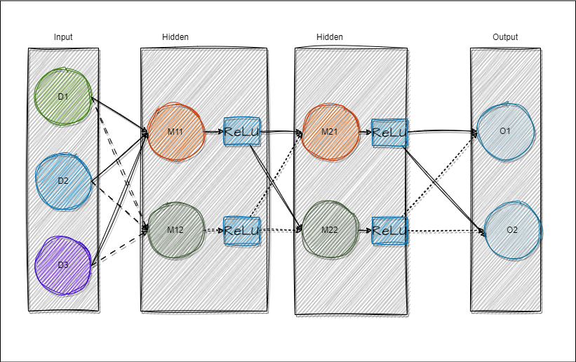

# Activation function
+ e.g:  


+ what if without activation function ?
  the model can only learn leanr classifications. Using activation fuctions allows the model to become nonlinear.

+ What are the types of activation functions?
  + sigmoid, tanh, ReLu, Leaky ReLU, ELU, Maxout,

https://zhuanlan.zhihu.com/p/32824193


+ Why ReLu function is nonlinear?
```math
ReLU = max(0,x); \\

ReLU' = \begin{cases}
  0 & \text{if } x \leq 0 \\
  1 & \text{if } x > 0
\end{cases}
```
https://zhuanlan.zhihu.com/p/405068757#%E4%B8%80%E3%80%81%E5%9B%BE%E5%83%8F%E5%88%86%E6%9E%90

It's the stacking and addition operations that give ReLU networks their non-linearity.

# Activation for output layer

+ What are the types of activation？
https://www.zhihu.com/question/462549835

+ common: sigmod, softmax.
```math 
sigmod = \frac{1}{1+e^{-x}} \\

softmax(x_j) = \frac{e^{x_j}}{\sum^K_{k=1} e^{x_k}}

```

**due to the presence of exponentials, larger input values will result in even larger output values**


+ In code, in order to avoid float point overflow, it's commonly practice to subtract the largest x before applying softmax.
```math
softmax(x_j) = \frac{e^{x_j-x_{max}}}{\sum^K_{k=1} e^{x_k-x_{max}}}
```


