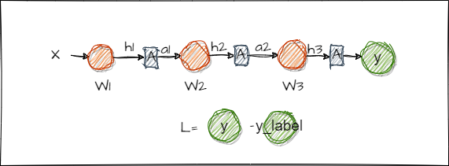
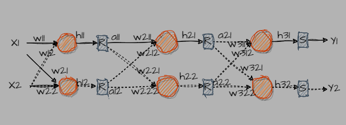

# Loss
First we shoule know:
+ The purpose of training is to find a set of weights that results in a minimum loss. 
+ So that, the gradient of loss with respect to the weights can be considered as the effect of weights on the loss.
+ Therefore, the new wiehgts should updated in the opposite direction of graident, which is $w^* = w - g$. 

# A simple case of back propagation
[Ref](https://zhuanlan.zhihu.com/p/115571464)

Basically, it can be seen as a function operation.

Take the function $y=f(x) = ax+b$ as an example. 

Then, we have:
```math  
  \frac{dy}{dx} = f'(x) = a
``` 
So, when
```math
  y = f(x,z) = ax+bz
```
What is : $\frac{dy}{dx} = ?$

Here, it can be considered as an function on a 2-dims plan (for example an altitude map).By computing its derivative with respect to x, we get partial derivative. (what is the graident? in practice, it is the change in altitude when moving a unit distance in a specific direction.)

So Does this thing relates to y?. If the term involving x includes y, then it does, otherwise, it doesn't. 

Therefore, we have:
```math
  \frac{dy}{dx} = ax^{1-1=0} = a = \frac{\partial{y}}{\partial{x}}
```


 + box "A" is activation function. (can just consider it as y=x here)

Now, Aussuming there is a 3-layer model, with one node in each layer. When $L=MSE(y,y_{label}) = \frac{(y-y_{lable})^2}{n}$, in order to computing the effect of y on L, we have:

```math
\frac{\partial{L}}{\partial{y}} = \frac{2*(y-y_{label})}{n}
```

The the effect of $w_3$ on L:
```math
\frac{\partial{L}}{\partial{w_3}} = \frac{\partial{h_3}}{\partial{w_3}} * \frac{\partial{y}}{\partial{h_3}} * \frac{\partial{L}}{\partial{y}} = a_2 *  [\frac{\partial{y}}{\partial{h_3}}] * \Delta{y}
```
+ Thinking 1: can we ignore the derivation of "softmax"? 
  > yes, because softmax is just "amplifying" the differences in y.


Similar, we get the effect of $w_2$ on L:
```math
\begin{align*}
\frac{\partial{L}}{\partial{w_2}} &= \frac{\partial{h_2}}{\partial{w_2}} \cdot \frac{\partial{a_2}}{\partial{h_2}} \cdot \frac{\partial{h_3}}{\partial{a_2}} \cdot \left[\frac{\partial{y}}{\partial{h_3}}\right] \cdot \frac{\partial{L}}{\partial{y}} \\
&= a_1 \cdot A'(h_2) \cdot w_3 \cdot \left[\frac{\partial{y}}{\partial{h_3}}\right] \cdot \Delta{y}
\end{align*}
```

# More nodes in each layer!

+ box R: relue
+ box S: softmax
+ sphere: node
+ w: weights

Here, the forward propagation is:
```math
\begin{align}
  \begin{pmatrix}
  x1 & x2 \\
  \end{pmatrix}  
  *
  \begin{pmatrix}
  w_{11} & w_{21} \\
  w_{12} & w_{22} \\
  \end{pmatrix}
  &=
  \begin{pmatrix}
  x_1*w_{11}+ x_2*w_{12} &  x_1*w_{21}+x_2*w_{12} \\
  \end{pmatrix} \\
  &=
  \begin{pmatrix}
  h_{11} &  h_{12} \\
  \end{pmatrix}
\end{align}
```
So, the whole network is:
``` math
\begin{align}
  \begin{pmatrix}
  x1 & x2 \\
  \end{pmatrix}  
  \begin{pmatrix}
  w_{11} & w_{21} \\
  w_{12} & w_{22} \\
  \end{pmatrix}
  &->
  \begin{pmatrix}
  h_{11} &  h_{12} \\
  \end{pmatrix}
  -> \\  
  \begin{pmatrix}
  a_{11} &  a_{12} \\
  \end{pmatrix}

  \begin{pmatrix}
  w_{211} & w_{221} \\
  w_{212} & w_{222} \\
  \end{pmatrix}
  &->
  \begin{pmatrix}
  h_{21} &  h_{22} \\
  \end{pmatrix}
  -> \\
  \begin{pmatrix}
  a_{21} &  a_{22} \\
  \end{pmatrix}
  \begin{pmatrix}
  w_{311} & w_{321} \\
  w_{312} & w_{322} \\
  \end{pmatrix}
  &->
  \begin{pmatrix}
  h_{31} &  h_{32} \\
  \end{pmatrix}
  ->
  \begin{pmatrix}
  y_{1} &  y_{2} \\
  \end{pmatrix}
\end{align}
```

# Back propagtion
```math 
\frac{\partial{L}}{\partial{y_1}} = y_1 - y_1^{label} \\ 
\frac{\partial{L}}{\partial{y_2}} = y_2 - y_2^{label}
```
$w_{311}$ 对 L 的影响
```math
\frac{\partial{L}}{\partial{w_{311}}} = 
\frac{\partial{h_{31}}}{\partial{w_{311}}} * \frac{\partial{y_1}}{\partial{h_{31}}} * \frac{\partial{L}}{\partial{y_1}} = a_{21} * [\frac{\partial{y_1}}{\partial{h_{31}}} ] * ( y_1 - y_1^{label})
```
$w_{312}$ 对 L 的影响
```math
\frac{\partial{L}}{\partial{w_{312}}} = 
\frac{\partial{h_{31}}}{\partial{w_{312}}} * \frac{\partial{y_1}}{\partial{h_{31}}} * \frac{\partial{L}}{\partial{y_1}} = a_{22} * [\frac{\partial{y_1}}{\partial{h_{31}}} ] * ( y_1 - y_1^{label})
```
$w_{321}$ 对 L 的影响
```math
\frac{\partial{L}}{\partial{w_{321}}} = 
\frac{\partial{h_{32}}}{\partial{w_{321}}} * \frac{\partial{y_2}}{\partial{h_{32}}} * \frac{\partial{L}}{\partial{y_2}} = a_{21} * [\frac{\partial{y_2}}{\partial{h_{32}}} ] * ( y_2 - y_2^{label})
```
$w_{322}$ 对 L 的影响
```math
\frac{\partial{L}}{\partial{w_{322}}} = 
\frac{\partial{h_{32}}}{\partial{w_{322}}} * \frac{\partial{y_2}}{\partial{h_{32}}} * \frac{\partial{L}}{\partial{y_2}} = a_{22} * [\frac{\partial{y_2}}{\partial{h_{32}}} ] * ( y_2 - y_2^{label})
```
**暂将Softmax函数考虑为y=x**
+ 思考为什么可以

那么 上面 第三次的参数 $W_3$ 对 L的影响可以重写成
```math 
\begin{align}
dw_{311} &= a_{21} * \Delta{y_1} \\  
dw_{312} &= a_{22} * \Delta{y_1} \\  
dw_{321} &= a_{21} * \Delta{y_2} \\  
dw_{322} &= a_{22} * \Delta{y_1} \\  
\end{align}
```
将 $dw$ 按 $W_3$ 的矩阵排列
```math
\begin{pmatrix}
dw_{311} &  dw_{321} \\
dw_{312} &  dw_{322} \\
\end{pmatrix}
= 
\begin{pmatrix}
a_{21} * \Delta{y_1}  &  a_{21} * \Delta{y_2} \\
a_{22} * \Delta{y_1} &  a_{22} * \Delta{y_1} \\
\end{pmatrix}
=
\begin{pmatrix}
a_{21} \\ a_{22} \\
\end{pmatrix}
*
\begin{pmatrix}
\Delta{y_{1}} && \Delta{y_{2}} \\
\end{pmatrix}
= 
\begin{pmatrix}
a_{21} & a_{22} \\
\end{pmatrix}^T
*
\begin{pmatrix}
\Delta{y_{1}} && \Delta{y_{2}} \\
\end{pmatrix}
```

现计算 $w_{211}，w_{212}， w_{221}， w_{222}$ 对 L的影响 （1）:
```math
\frac{\partial{L}}{\partial{w_{211}}} = \frac{\partial{h_{21}}}{\partial{w_{211}}} * \frac{\partial{a_{21}}}{\partial{h_{21}}} * \frac{\partial{L}}{\partial{a_{21}}} = a_{11} * Relu'(h_{21}) *  \frac{\partial{L}}{\partial{a_{21}}}  = dw_{211} \\  
```
```math
\frac{\partial{L}}{\partial{w_{212}}} = \frac{\partial{h_{21}}}{\partial{w_{212}}} * \frac{\partial{a_{21}}}{\partial{h_{21}}}* \frac{\partial{L}}{\partial{a_{21}}} = a_{12} * Relu'(h_{21}) * \frac{\partial{L}}{\partial{a_{21}}}  = dw_{212}  \\ 
``` 
```math
\frac{\partial{L}}{\partial{w_{221}}} = \frac{\partial{h_{22}}}{\partial{w_{221}}} * \frac{\partial{a_{22}}}{\partial{h_{22}}} * \frac{\partial{L}}{\partial{a_{22}}} = a_{11} * Relu'(h_{22}) * \frac{\partial{L}}{\partial{a_{22}}}  =  dw_{221} \\ 
``` 
```math
\frac{\partial{L}}{\partial{w_{222}}} = \frac{\partial{h_{22}}}{\partial{w_{222}}} * \frac{\partial{a_{22}}}{\partial{h_{22}}} * \frac{\partial{L}}{\partial{a_{22}}} = a_{12} * Relu'(h_{22}) * \frac{\partial{L}}{\partial{a_{22}}} =  dw_{222}
```
重写成:
``` math
\begin{align}
  \begin{pmatrix}
  dw_{211} &  dw_{221} \\
  dw_{212} &  dw_{222} \\
  \end{pmatrix}
  &= 
  \begin{pmatrix}
  a_{11} * Relu'(h_{21}) * \frac{\partial{L}}{\partial{a_{21}}}  &  a_{11} * Relu'(h_{22}) * \frac{\partial{L}}{\partial{a_{22}}}  \\
  a_{12} * Relu'(h_{21}) * \frac{\partial{L}}{\partial{a_{21}}} & a_{12} * Relu'(h_{22}) * \frac{\partial{L}}{\partial{a_{22}}}
  \end{pmatrix} \\  
  &=
  \begin{pmatrix}
  a_{11} &  a_{12} \\
  \end{pmatrix}^T
  *
  \begin{pmatrix}
  Relu'(h_{21}) * \frac{\partial{L}}{\partial{a_{21}}} &   Relu'(h_{22}) * \frac{\partial{L}}{\partial{a_{22}}} \\
  \end{pmatrix} \\  

  &= 
  \begin{pmatrix}
  a_{11} &  a_{12} \\
  \end{pmatrix}^T
  * 
  \begin{pmatrix}
  \frac{\partial{L}}{\partial{a_{21}}} &  \frac{\partial{L}}{\partial{a_{22}}}  \\
  \end{pmatrix} * 
  \begin{pmatrix}
  Relu'(h_{21})  &  0  \\
  0 & Relu'(h_{22})
  \end{pmatrix} 
\end{align}

```
+ **或者直接理解为向量乘法**

**那么 $\frac{\partial{L}}{\partial{a_{21}}}$, $\frac{\partial{L}}{\partial{a_{22}}}$ 怎么算？**
```math 
\frac{\partial{L}}{\partial{a_{21}}} = \frac{\partial{h_{31}}}{\partial{a_{21}}} * \frac{\partial{y_{1}}}{\partial{h_{31}}} * \frac{\partial{L}}{\partial{y_{1}}}  + \frac{\partial{h_{32}}}{\partial{a_{21}}}* \frac{\partial{y_{2}}}{\partial{h_{32}}} * \frac{\partial{L}}{\partial{y_{2}}}= w_{311} * 1 * \Delta{y_1} + w_{321} * 1 * \Delta{y_2} \\
```
```math 
\frac{\partial{L}}{\partial{a_{22}}} = \frac{\partial{h_{31}}}{\partial{a_{22}}} * \frac{\partial{y_1}}{\partial{h_{31}}} * \frac{\partial{L}}{\partial{y_{1}}}  + \frac{\partial{h_{32}}}{\partial{a_{22}}} * \frac{\partial{y_{2}}}{\partial{a_{32}}}* \frac{\partial{L}}{\partial{y_{2}}} = w_{312} * 1 * \Delta{y_{1}} + w_{322} * 1 * \Delta{y_{2}}
```
所以
```math
\begin{pmatrix}
\frac{\partial{L}}{\partial{a_{21}}} & \frac{\partial{L}}{\partial{a_{22}}} 
\end{pmatrix}
= 
\begin{pmatrix}
w_{311} * \Delta{y_1} + w_{321} * \Delta{y_2} & w_{312} * \Delta{y_{1}} + w_{322} *  \Delta{y_{2}}
\end{pmatrix}
= \\
\begin{pmatrix}
\Delta{y_1} & \Delta{y_2} \\
\end{pmatrix}
*
\begin{pmatrix}
w_{311} & w_{312} \\
w_{321} & w_{322}
\end{pmatrix}
```

所以 $W_2$ 有
```math
\begin{pmatrix}
dw_{211} &  dw_{221} \\
dw_{212} &  dw_{222} \\
\end{pmatrix}
= 
\begin{pmatrix}
a_{11} &  a_{12} \\
\end{pmatrix}^T
* 
{
\begin{pmatrix}
\Delta{y_1} & \Delta{y_2} \\
\end{pmatrix}
*
\begin{pmatrix}
w_{311} & w_{321} \\
w_{312} & w_{322}
\end{pmatrix}^T
}
 * 
\begin{pmatrix}
Relu'(h_{21})  &  0  \\
0 & Relu'(h_{22})
\end{pmatrix} 
```

总结推理:
```math
\begin{align}
dW_3 &= A_{2}^T * L \\
dW_2 &= A_{1}^T * L * W_{3}^T * Relu'(Det(h_2)) \\ 
dW_1 &= A_{1}^T * (L * W_{3}^T * Relu'(Det(h_2))) * W_{2}^T * Relu'(Det(h_1)) \\ 
\end{align}
```
本质上 输出层是一个参数为 如下的 连接层:
```math
\begin{pmatrix}
h_{31} & h_{32} \\
\end{pmatrix}
* 
\begin{pmatrix}
1 & 0 \\
0 & 1 \\
\end{pmatrix}
= 
\begin{pmatrix}
y_1 & y_2 \\
\end{pmatrix}
```

所以 进一步 有
```math
\begin{align}
dz_3 &= L \\
dW_3 &= A_{2}^T * dz_3 \\
dz_2 & = L  * W_{3}^T * Relu'(Det(h_2)) \\
dW_2 &= A_{1}^T * dz_2 \\ 
dz_1 &= dz_2 * W_{2}^T * Relu'(Det(h_1)) \\
dW_1 &= A_{1}^T * dz_1\\ 
\end{align}
```

+ TODO 参数层初始值的选择, 怎么初始化，初始化的很大会怎么样子?
+ TODO 输入层的归一化, 为什么要, 没有会怎么样子
+ TODO Relu函数在 0 处的导数为什么时0，不是1?，如果时1会有什么影响?
+ TODO fix MES loss 的计算: 最后应该时除以batch size