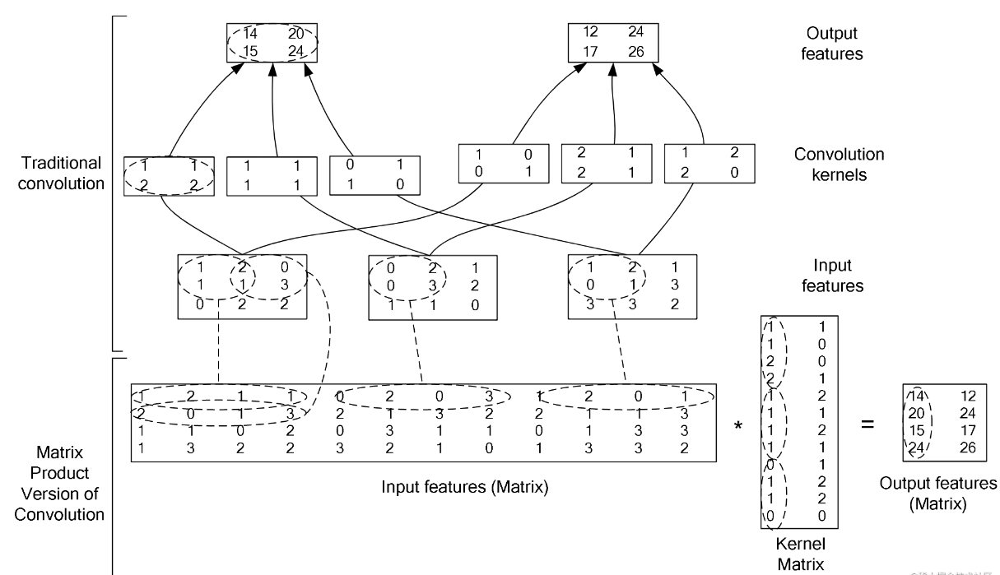
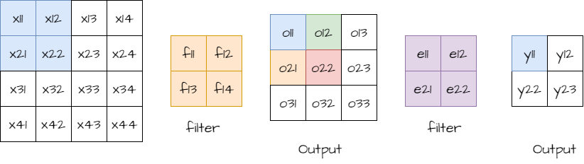

# This file is to give a simple explain of CNN
[REF-WIKI](https://en.wikipedia.org/wiki/Convolution)
[REF-Mediumblog](https://pavisj.medium.com/convolutions-and-backpropagations-46026a8f5d2c)

# Chain rule in CNN
We know the way to back propagate in a FC network, but how does it work in a CNN?

# What is CNN
First, what is a CNN: a network consisting of Convolutional layers. 

# Convolutional layer
What is Convolution?. Explaining it in words can be challenging. But we can show it wiht a gif(from wiki)!


And a smaller sacle example:


!Now, it is same to a fc network. 

```math
O_{11} = X_{11}F_{11} + X_{12}F_{12} + X_{21}F_{21} + X_{22}F_{22} \\
O_{12} = X_{12}F_{11} + X_{13}F_{12} + X_{22}F_{21} + X_{23}F_{22} \\
O_{21} = X_{21}F_{11} + X_{22}F_{12} + X_{31}F_{21} + X_{32}F_{22} \\
O_{22} = X_{22}F_{11} + X_{23}F_{12} + X_{32}F_{21} + X_{33}F_{22}
```

# what if there is more than one channel?
Sum them up!


# Image to cols
[REF](https://www.mo4tech.com/high-performance-convolution-computing-img2col-principle-explained.html)

Can we convert convolution into matrix dot operation? ! **Image to cols**.



Now, we can use dot operation to calculate cnn convolution!. 

From this figure, given a matrix [N,C,H,W] and filter [K,K] we can get the resolution of converted matrix:


Colum size:
```math 
  W' = C * K * K
```

Row size:
```math
  H' = N * (\frac{(W - K + P)}{S}+1) *（\frac{(H - K + P)}{S}+1）
```

In this context:
+ N is the number of samples.
+ C is the number of channels.
+ H is the height of the input matrix.
+ W is the width of the input matrix.
+ K is the size of the filter.
+ P is the padding applied to the input matrix.
+ S is the stride of the filter.


# Back propagation
Let's compute the effect of $F_{11}$ on O:

```math
\frac{\partial{O_{11}}}{\partial{F_{11}}} = X_{11} \\
\frac{\partial{O_{12}}}{\partial{F_{11}}} = X_{12} \\
\frac{\partial{O_{21}}}{\partial{F_{11}}} = X_{21} \\
\frac{\partial{O_{22}}}{\partial{F_{11}}} = X_{22} \\
```

Then, we have:

```math
\frac{\partial{O}}{\partial{F_{11}}} = 
\frac{\partial{O_{11}}}{\partial{F_{11}}} + 
\frac{\partial{O_{12}}}{\partial{F_{11}}} + 
\frac{\partial{O_{21}}}{\partial{F_{11}}} + 
\frac{\partial{O_{22}}}{\partial{F_{11}}} 
```
And according the chain rule:

```math 
\frac{\partial {L}}{\partial{F}} = 
\frac{\partial {L}}{\partial{O}} * 
\frac{\partial {O}}{\partial{F}}

```
Thus, we get:

```math
\begin{align}
\frac{\partial{L}}{\partial{F_{11}}} &= 
\frac{\partial {L}}{\partial{O_{11}}}
\frac{\partial{O_{11}}}{\partial{F_{11}}} + 
\frac{\partial {L}}{\partial{O_{12}}}
\frac{\partial{O_{12}}}{\partial{F_{11}}} + 
\frac{\partial {L}}{\partial{O_{21}}}
\frac{\partial{O_{21}}}{\partial{F_{11}}} +
\frac{\partial {L}}{\partial{O_{22}}}
\frac{\partial{O_{22}}}{\partial{F_{11}}} \\
&= 
\frac{\partial {L}}{\partial{O_{11}}} X_{11} + 
\frac{\partial {L}}{\partial{O_{12}}} X_{12} +
\frac{\partial {L}}{\partial{O_{21}}} X_{21} +
\frac{\partial {L}}{\partial{O_{22}}} X_{22}

\end{align}
```

Similary we can get that for $F_{12}, F_{21}, F_{22}$:

```math
\begin{align}
O_{11} &= X_{11}F_{11} + X_{12}F_{12} + X_{21}F_{21} + X_{22}F_{22} \\
O_{12} &= X_{12}F_{11} + X_{13}F_{12} + X_{22}F_{21} + X_{23}F_{22} \\
O_{21} &= X_{21}F_{11} + X_{22}F_{12} + X_{31}F_{21} + X_{32}F_{22} \\
O_{22} &= X_{22}F_{11} + X_{23}F_{12} + X_{32}F_{21} + X_{33}F_{22} \\
\end{align}
```


``` math
\begin{align}
\frac{\partial{L}}{\partial{F_{11}}} &= 
\frac{\partial{L}}{\partial{O_{11}}} X_{11} + 
\frac{\partial{L}}{\partial{O_{12}}} X_{12} +
\frac{\partial{L}}{\partial{O_{21}}} X_{21} +
\frac{\partial{L}}{\partial{O_{22}}} X_{22} \\
\frac{\partial{L}}{\partial{F_{12}}} &= 
\frac{\partial{L}}{\partial{O_{11}}} X_{12} + 
\frac{\partial{L}}{\partial{O_{12}}} X_{13} +
\frac{\partial{L}}{\partial{O_{21}}} X_{22} +
\frac{\partial{L}}{\partial{O_{22}}} X_{23} \\
\frac{\partial{L}}{\partial{F_{21}}} &= 
\frac{\partial{L}}{\partial{O_{11}}} X_{21} + 
\frac{\partial{L}}{\partial{O_{12}}} X_{22} +
\frac{\partial{L}}{\partial{O_{21}}} X_{31} +
\frac{\partial{L}}{\partial{O_{22}}} X_{32} \\
\frac{\partial{L}}{\partial{F_{22}}} &= 
\frac{\partial{L}}{\partial{O_{11}}} X_{22} + 
\frac{\partial{L}}{\partial{O_{12}}} X_{23} +
\frac{\partial{L}}{\partial{O_{21}}} X_{32} +
\frac{\partial{L}}{\partial{O_{22}}} X_{33}
\end{align}

```

We can see it is a convolution operation!


Now how to compute $\frac{\partial{L}}{\partial{O}}$?

