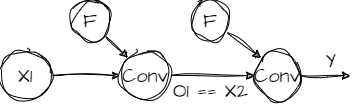
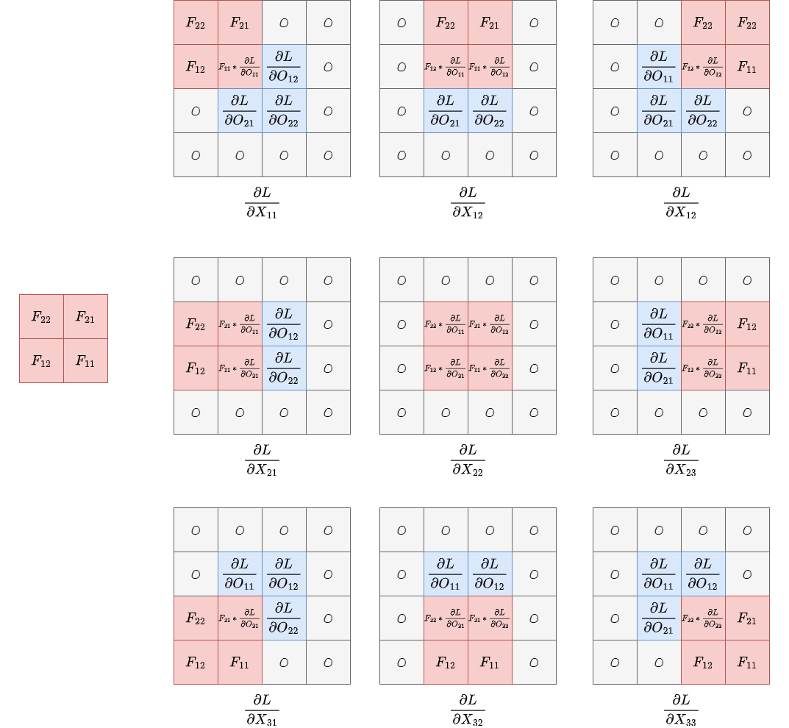

# to give a simple explain of CNN
[REF-WIKI](https://en.wikipedia.org/wiki/Convolution)
[REF-Mediumblog](https://pavisj.medium.com/convolutions-and-backpropagations-46026a8f5d2c)

# Chain rule in CNN
We know the way to back propagate in a FC network, but how does it work in a CNN?

# What is CNN
First, what is a CNN: a network consisting of Convolutional layers. 

# Convolutional layer
What is Convolution?. Explaining it in words can be challenging. But we can show it wiht a gif(from wiki)!


And a smaller sacle example:


!Now, it is same to a fc network. 

```math
\begin{align}
O_{11} &= X_{11}F_{11} + X_{12}F_{12} + X_{21}F_{21} + X_{22}F_{22} \\
O_{12} &= X_{12}F_{11} + X_{13}F_{12} + X_{22}F_{21} + X_{23}F_{22} \\
O_{21} &= X_{21}F_{11} + X_{22}F_{12} + X_{31}F_{21} + X_{32}F_{22} \\
O_{22} &= X_{22}F_{11} + X_{23}F_{12} + X_{32}F_{21} + X_{33}F_{22}
\end{align}
```

# What if there is more than one channel?
Sum them up!


# Back propagation
## L to F
### When stride = 1
Let's compute the effect of $F_{11}$ on O:

```math
\frac{\partial{O_{11}}}{\partial{F_{11}}} = X_{11} \\
\frac{\partial{O_{12}}}{\partial{F_{11}}} = X_{12} \\
\frac{\partial{O_{21}}}{\partial{F_{11}}} = X_{21} \\
\frac{\partial{O_{22}}}{\partial{F_{11}}} = X_{22} \\
```

Then, we have:

```math
\frac{\partial{O}}{\partial{F_{11}}} = 
\frac{\partial{O_{11}}}{\partial{F_{11}}} + 
\frac{\partial{O_{12}}}{\partial{F_{11}}} + 
\frac{\partial{O_{21}}}{\partial{F_{11}}} + 
\frac{\partial{O_{22}}}{\partial{F_{11}}} 
```
And according the chain rule:

```math 
\frac{\partial {L}}{\partial{F}} = 
\frac{\partial {L}}{\partial{O}} * 
\frac{\partial {O}}{\partial{F}}

```
Thus, we get:

```math
\begin{align}
\frac{\partial{L}}{\partial{F_{11}}} &= 
\frac{\partial {L}}{\partial{O_{11}}}
\frac{\partial{O_{11}}}{\partial{F_{11}}} + 
\frac{\partial {L}}{\partial{O_{12}}}
\frac{\partial{O_{12}}}{\partial{F_{11}}} + 
\frac{\partial {L}}{\partial{O_{21}}}
\frac{\partial{O_{21}}}{\partial{F_{11}}} +
\frac{\partial {L}}{\partial{O_{22}}}
\frac{\partial{O_{22}}}{\partial{F_{11}}} \\
&= 
\frac{\partial {L}}{\partial{O_{11}}} X_{11} + 
\frac{\partial {L}}{\partial{O_{12}}} X_{12} +
\frac{\partial {L}}{\partial{O_{21}}} X_{21} +
\frac{\partial {L}}{\partial{O_{22}}} X_{22}

\end{align}
```

Similary we can get that for $F_{12}, F_{21}, F_{22}$:

```math
\begin{align}
O_{11} &= X_{11}F_{11} + X_{12}F_{12} + X_{21}F_{21} + X_{22}F_{22} \\
O_{12} &= X_{12}F_{11} + X_{13}F_{12} + X_{22}F_{21} + X_{23}F_{22} \\
O_{21} &= X_{21}F_{11} + X_{22}F_{12} + X_{31}F_{21} + X_{32}F_{22} \\
O_{22} &= X_{22}F_{11} + X_{23}F_{12} + X_{32}F_{21} + X_{33}F_{22}
\end{align}
```


``` math
\begin{align}
\frac{\partial{L}}{\partial{F_{11}}} &= \frac{\partial{L}}{\partial{O_{11}}} X_{11} + \frac{\partial{L}}{\partial{O_{12}}} X_{12} + \frac{\partial{L}}{\partial{O_{21}}} X_{21} + \frac{\partial{L}}{\partial{O_{22}}} X_{22} \\
\frac{\partial{L}}{\partial{F_{12}}} &= \frac{\partial{L}}{\partial{O_{11}}} X_{12} + \frac{\partial{L}}{\partial{O_{12}}} X_{13} + \frac{\partial{L}}{\partial{O_{21}}} X_{22} + \frac{\partial{L}}{\partial{O_{22}}} X_{23} \\
\frac{\partial{L}}{\partial{F_{21}}} &= \frac{\partial{L}}{\partial{O_{11}}} X_{21} + \frac{\partial{L}}{\partial{O_{12}}} X_{22} + \frac{\partial{L}}{\partial{O_{21}}} X_{31} + \frac{\partial{L}}{\partial{O_{22}}} X_{32} \\
\frac{\partial{L}}{\partial{F_{22}}} &= \frac{\partial{L}}{\partial{O_{11}}} X_{22} + \frac{\partial{L}}{\partial{O_{12}}} X_{23} + \frac{\partial{L}}{\partial{O_{21}}} X_{32} + \frac{\partial{L}}{\partial{O_{22}}} X_{33}
\end{align}

```

We can see it is a convolution operation!


### When stride is not 1

What if stride = 2 ? **Fill 0!!!**


It is a stride = 1 convolution again！


## L to X

Now how to compute $\frac{\partial{L}}{\partial{O}}$?




From this figure, we see:

```math
  \frac{\partial{L}}{\partial{O_1}} = \frac{\partial{L}}{\partial{X_2}} 
```

This means, the gradient of L with repsect to the output of current layer is the gradient of L with repsect to the X in next level.

So, in other word, we need to compute the graident of O respect to the X in each layer for the previous layer. 

Then, how?

```math
\begin{align}
O_{11} &= X_{11}F_{11} + X_{12}F_{12} + X_{21}F_{21} + X_{22}F_{22} \\
O_{12} &= X_{12}F_{11} + X_{13}F_{12} + X_{22}F_{21} + X_{23}F_{22} \\
O_{21} &= X_{21}F_{11} + X_{22}F_{12} + X_{31}F_{21} + X_{32}F_{22} \\
O_{22} &= X_{22}F_{11} + X_{23}F_{12} + X_{32}F_{21} + X_{33}F_{22}
\end{align}
```

Thus:

```math 

\begin{align}
\frac{\partial{L}}{\partial{X_{11}}} &=  \frac{\partial{L}}{\partial{O_{11}}} * F_{11}  \\
\frac{\partial{L}}{\partial{X_{12}}} &=  \frac{\partial{L}}{\partial{O_{11}}} * F_{12} + \frac{\partial{L}}{\partial{O_{12}}} * F_{11} \\
\frac{\partial{L}}{\partial{X_{13}}} &= \frac{\partial{L}}{\partial{O_{12}}} * F_{12}  \\
\frac{\partial{L}}{\partial{X_{21}}} &= \frac{\partial{L}}{\partial{O_{11}}} * F_{21} + \frac{\partial{L}}{\partial{O_{21}}} * F_{11} \\
\frac{\partial{L}}{\partial{X_{22}}} &= \frac{\partial{L}}{\partial{O_{11}}} * F_{22} + \frac{\partial{L}}{\partial{O_{12}}} * F_{21} + \frac{\partial{L}}{\partial{O_{21}}} * F_{12} + \frac{\partial{L}}{\partial{O_{22}}} * F_{11} \\
\frac{\partial{L}}{\partial{X_{23}}} &= \frac{\partial{L}}{\partial{O_{12}}} * F_{22} + \frac{\partial{L}}{\partial{O_{22}}} * F_{21} \\
\frac{\partial{L}}{\partial{X_{31}}} &=  \frac{\partial{L}}{\partial{O_{21}}} * F_{21} \\
\frac{\partial{L}}{\partial{X_{32}}} &=  \frac{\partial{L}}{\partial{O_{21}}} * F_{22} + \frac{\partial{L}}{\partial{O_{22}}} * F_{21} \\
\frac{\partial{L}}{\partial{X_{33}}} &= \frac{\partial{L}}{\partial{O_{22}}} * F_{22}
\end{align}
```

It actually is a convolution operation! Here is the compelet format:





# A 3 layer CNN

Now assuming the input is NCHW,
+ N: batch size 
+ C: Channel
+ H: height 
+ W: width 

INPUT: N: 256, C:3, H:28, W:28
CONV: Kernel 3, stride 2, padding 1, 3 channel for each filter,  32 filters
O1: 256 * 32 * (28+2*1-2)/2 + 1 = 15 * 15

Img2cols(INPUT):

```math
 [256 * 15 * 15][3 * 3 * C]
```

dot op:

```math
  [256 * 15 * 15][3 * 3 * C] \cdot [3*3*C][32]
```

get:

```math
  [256 * 15 * 15][32]
```

which is N*HW*C.

And this layer backpropagtion should be:

For filter:

```math

\frac{\partial{L}}{\partial{F}} = \text{input conv } \frac{\partial{L}}{\partial{O}}

```
<!-- 256 * C * 28 * 28 -->
<!-- 256 * 32 * 15 * 15 -->
<!-- C * 3 * 3 -->
<!--  O: (28+2*1-15)/2+1 = 8 -->
<!--  -->