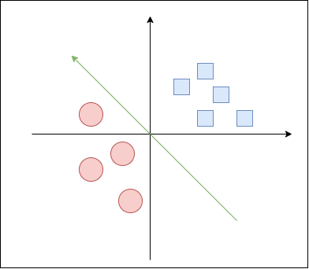
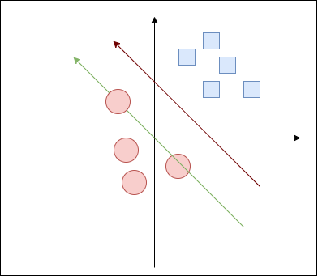
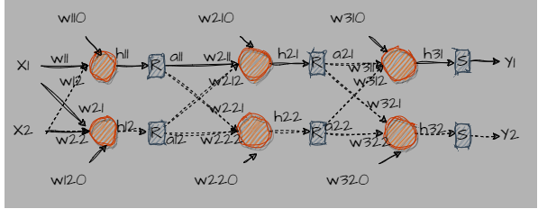

# Bias
Well now, let's consider the bias. 

## What is bias? what is it for? 
[REF](https://www.cnblogs.com/jiading/p/11620999.html)

let's review the basic linear function: $y=ax$.

This is a line passing throguh the origin. For case like the following figure, this function can handle it well.



But in a case like this:



In situations where the data points do not pass through the origin, we need to adjust our linear function to accommodate this. This is where the bias term comes into play.

By introducing a bias term $𝑏$, we modify our linear function to: $y=ax+b$

This allows the line to shift up or down, effectively enabling it to fit data points that are offset from the origin. The bias term 
b can be thought of as the y-intercept of the line, providing the flexibility needed to accurately model a wider range of data sets.

In summary, the bias term is essential for adjusting the position of the line, allowing it to better fit data that are not centered around the origin. This enhances the flexibility and accuracy of the model.

## how to update it in back propagtion?



Take node $N_{31}$ as example.

```math
h_{31} = w_{311}*a_{21}+ w_{312}*a_{22} + w_{310}
```

The derivation of $h_{31}$ with repsect to bias:

```math
\frac{\partial{h_{31}}}{\partial{w_{310}}} = 1

```

Thus the derivation of L with respect to bias:

```math 
\begin{align}

\frac{\partial{L}}{\partial{w_{310}}} =
\frac{\partial{L}}{\partial{h_{31}}}
\frac{\partial{h_{31}}}{\partial{w_{310}}}
=
\frac{\partial{L}}{\partial{h_{31}}} * 1
\end{align}
```

Similar, for the biases of third layer:

```math 
\frac{\partial{L}}{\partial{w_{310}}} = \frac{\partial{L}}{\partial{h_{31}}} = \Delta y_1 \\

\frac{\partial{L}}{\partial{w_{320}}} = \frac{\partial{L}}{\partial{h_{32}}} = \Delta y_2
```

which is also a matrix dot operation:

```math
 dB_3 = L
```

for layer 2:

```math 
\frac{\partial{L}}{\partial{w_{210}}} = \frac{\partial{L}}{\partial{h_{21}}} \\

\frac{\partial{L}}{\partial{w_{220}}} = \frac{\partial{L}}{\partial{h_{22}}}

```

As the derivation in [back propagation](./backpropagation.md):

```math
\begin{align}
dz_3 &= L \\
dW_3 &= A_{2}^T * dz_3 \\
dz_2 & = dz_3  * W_{3}^T * Relu'(Det(h_2)) \\
dW_2 &= A_{1}^T * dz_2 \\ 
dz_1 &= dz_2 * W_{2}^T * Relu'(Det(h_1)) \\
dW_1 &= Input^T * dz_1\\ 
\end{align}
```

we can get:

```math
\begin{align} 
dB_3 &= ones * dz_3 = ones * L \\
dB_2 &= ones* dz_3 * W_{3}^T * Relu'(Det(h_2)) = ones * dz_2 \\
dB_1 &= ones * dz_2 * * W_{2}^T * Relu'(Det(h_1)) = ones * dz_1 
\end{align}
```