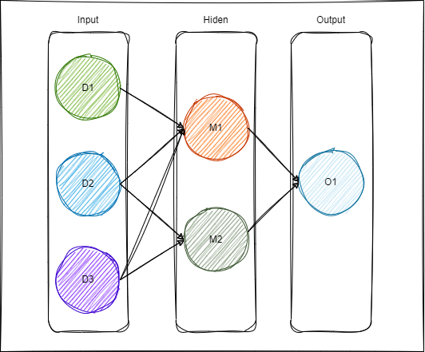

### Full connected Layer
+ e.g. A very simple example:  


1. Input: your data, e.g: using weather data (humidity，temperature，pressure) to predict if will rain tomorrow.
2. Hidden layer.
3. Output: predicted result.

+ The relationship between Dx and Mx.  
$$M_1 = W_{11}*D_1 + W_{12}*D_2 + W_{13}*D_3$$  
$$M_2 = W_{21}*D_1 + W_{22}*D_2 + W_{23}*D_3$$

+ Obviously, it's a matrix operation. Let $W$ denote the weight matrix, and $D$ denote the input data: 

```math
D=\begin{bmatrix}
D_1 & D_2 & D_3
\end{bmatrix} ,
W=\begin{bmatrix}
W_{11} & W_{21} \\
W_{12} & W_{22} \\
W_{13} & W_{23}
\end{bmatrix},
M=\begin{bmatrix}
 M_1 & M_2
\end{bmatrix}
```
