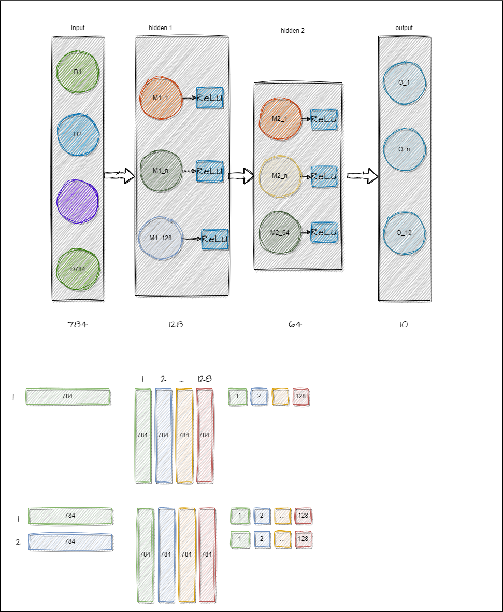

# A simple full connected model



+ consist of input layer, hidden 1, hidden 2, output layer.

+ 输入层是784(1张28*28像素展开后大小）， 中间层128：包含128个节点， 中间层64：包含64个节点，输出层10 包含10个节点(输出值0-9)

+ 当输入只有1张图片时(称为batch size == 1)，运算如中间图所示, 128个节点，每个节点都有784个参数，因为有784个输入连与它相连，那么共有 784*128个参数。
+ 当输入有2张图片时(成为batch size ==2)， 运算如最下图所示。batch size 并不会影响权重的个数

假设 batch size 为N， 则有
```math

(N,784) * (784,128) * (128,64) * (64*10) = (N*10)

```
所以最后 输出的时 N 个 1*10的向量。
